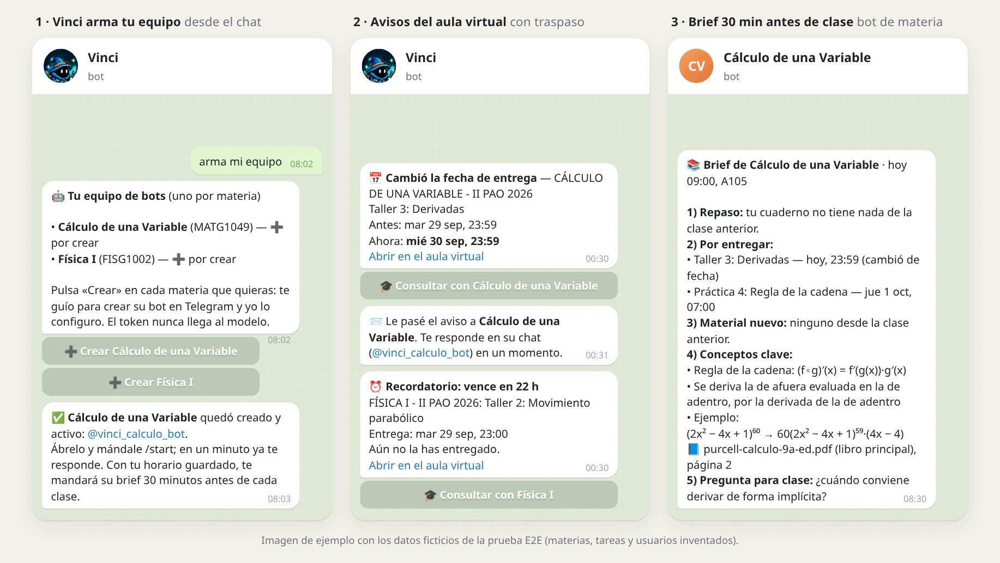
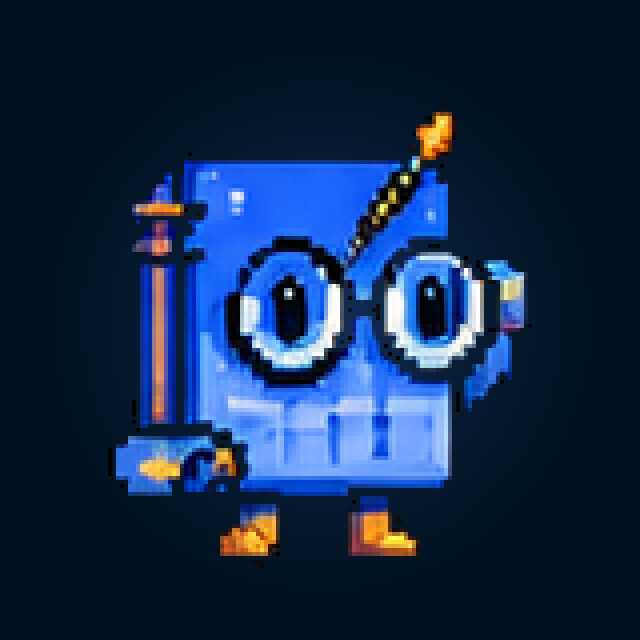

<div align="center">


# Vinci

**Tu asistente académico en Telegram.** Lee tu aula virtual, te avisa lo nuevo, arma un bot por
cada una de tus materias y te prepara para cada clase.


[Qué hace](#qué-hace) · [Cómo funciona](#cómo-funciona) · [Instalación](#instalación) ·
[Uso diario](#uso-diario-en-telegram) · [Seguridad](#seguridad-y-privacidad) ·
[Problemas](#solución-de-problemas) · [Contribuir](#contribuir)

</div>

> **In English:** Vinci is a self-hosted Telegram assistant for ESPOL students, built on
> [Hermes Agent](https://github.com/NousResearch/hermes-agent). It reads your Canvas courses
> (aulavirtual.espol.edu.ec) read-only, sends alerts and deadline reminders, and creates one Telegram bot per
> subject from your own courses. Each subject bot sends a brief 30 minutes before every class, keeps a
> notebook of what you covered, and answers questions from the course material with citations (file, page and
> aula link, checked against what the bot actually read before it is sent). Everything runs on your PC and answers
> only you. The rest of this README is in Spanish.

<p align="center">
  
</p>
<p align="center"><sub>Imagen de ejemplo armada con los datos ficticios de la prueba E2E: las materias, tareas y usuarios son inventados.</sub></p>

## ¿Qué es Vinci?

Vinci es un bot de Telegram que se conecta a tu aula virtual de ESPOL
([aulavirtual.espol.edu.ec](https://aulavirtual.espol.edu.ec), que es Canvas) y se encarga de lo que se te
escapa en el semestre: las tareas nuevas, los cambios de fecha, los anuncios del profe, las notas, el material
que suben y lo que vence mañana.

Además, Vinci arma **tu equipo**: lee las materias en las que estás inscrito y crea **un bot de Telegram por
materia**, con el nombre de esa materia. Cada bot de materia se especializa en la suya: te manda un repaso antes
de cada clase, lleva el cuaderno de lo que vieron y te ayuda a estudiar con el material del curso.


## Qué hace

| | |
|---|---|
| 🔔 **Avisos del aula virtual** | Revisa el aula cada 30 minutos y te avisa de tareas nuevas, cambios de fecha, anuncios, notas publicadas o cambiadas, material y enlaces nuevos y materias nuevas. Te recuerda cada entrega que aún no enviaste 24 h y 3 h antes, y a las 7:00 te manda el resumen de tu semana, con tus entregas en orden: lo que vence en 24 h y después lo que más vale en tu nota ([cómo las ordena](#el-resumen-de-las-700)). Si la entregaste en papel, por correo o en el laboratorio (el aula no se entera), pulsa «✅ Ya lo entregué» y no insiste más. |
| 📌 **Tu lista de pendientes** | «Anota: estudiar cap. 3 de Física para el viernes»: Vinci guarda lo que el aula no trae (lecturas, trámites, lo que el profe dijo en clase y no subió), con su materia y su fecha. Sale en el resumen de las 7:00 y en «¿qué tengo esta semana?», te lo recuerda 24 h y 3 h antes, y lo cierras con «✅ Hecho». |
| 📊 **Calculadora de notas** | «¿Cómo voy?», «¿cuánto necesito en la lección para pasar?», «¿y si saco 70 en el examen?»: aplica los pesos de cada materia a tus notas del aula (y a las que le cuentas) y te dice cuánto llevas y qué promedio necesitas en lo que falta. Los pesos los saca del sílabo, de las políticas del curso y de los anuncios, incluido cómo maneja cada materia el primer parcial sin examen por El Niño; lo que no encuentra te lo pregunta, y se guarda solo cuando pulsas «✅ Guardar esquema». Las cuentas las hace un script, no el modelo. [Más sobre la calculadora](#la-calculadora-de-notas). |
| 🤖 **Un bot por materia** | Le dices «arma mi equipo» y Vinci te propone un bot por cada materia de tu aula, que se crea con un toque tuyo. El teórico y el práctico de una materia comparten un solo bot. |
| 📚 **Brief antes de cada clase** | 30 minutos antes de cada clase de tu horario, el bot de esa materia te manda un repaso de la clase anterior, lo que vence, el material nuevo, 2 o 3 conceptos clave y una pregunta para hacerle al profe. |
| 📓 **Cuaderno de cada materia** | Cuéntale al bot lo que vieron o mándale una foto de la pizarra, una nota de voz o un PDF: lo guarda con un resumen. Lleva tus dudas y los temas que te cuestan, y los usa en los briefs. |
| 📄 **Preguntas sobre el material** | Cada bot tiene el catálogo de todo el material de su materia y baja lo que necesita. Se guía primero por el **libro principal** (el del sílabo, o el que tú le digas), busca en español y en inglés y te explica un tema, resume un capítulo o te hace preguntas tipo examen, citando archivo, página y el enlace del aula. [Más sobre el material](#el-material-de-cada-materia). |
| 🔎 **Citas que se comprueban** | Cada respuesta con material cita archivo, página (o diapositiva) y el enlace del aula, copiados de lo que el bot leyó. Antes de enviarla se revisa cada cita: una página que el bot no leyó o un archivo que no está en el material se cambia por un aviso, y un enlace que falta o está mal se corrige. Si el material no trae lo que preguntas, te dice «No está en el material» y recién después te lo explica con lo que sabe, avisando que eso no sale del material. |
| 📑 **PDFs escaneados que se pueden buscar** | Un PDF escaneado (una fotocopia, una hoja de ejercicios) se lee con OCR una sola vez, al bajarlo, y desde ahí la búsqueda lo encuentra como cualquier PDF. Las fórmulas, figuras y la letra a mano, que el OCR lee mal, el bot las sigue mirando como imagen. Necesita `tesseract` ([cómo](#pdfs-escaneados-ocr)). |
| 🧭 **Vinci ve todo junto** | Contesta sobre cualquier materia, arma planes de estudio con tus entregas y tus clases, lee los cuadernos de todos los bots y busca en la web. Le mandas «tengo esto de Física» con una foto y se lo pasa al bot correcto. |
| 🎓 **Traspaso con un botón** | Debajo de cada aviso hay un botón «🎓 Consultar con …»: el bot de la materia recibe el aviso y te explica qué implica en su chat. |
| 🗓️ **Horario desde una captura** | Le mandas a Vinci una captura de tu horario y te muestra cómo lo entendió; se guarda solo cuando pulsas «Guardar». |
| 🩺 **Estado del sistema** | Mándale `/estado` a Vinci (o corre `espol-bot doctor` en la terminal) y ves cuándo corrió el último sondeo, cuándo se leyó el aula, la edad del token de Canvas y si su cadena de renovación está sana, y qué feeds sin token están activos. Lo que está atrasado o roto sale con ❌ o ⚠️ y qué hacer. No usa el modelo. |
| 💻 **Terminal y Claude Code** | El comando `aula` consulta todo desde la terminal, y una skill le enseña a Claude Code a usarlo. |

Todo lo automático (revisar el aula, avisar, recordar, decidir cuándo toca un brief) lo hacen scripts fijos que
**no usan el modelo de IA ni gastan tokens**. Solo gastan tokens tus preguntas y lo que un bot tiene que escribir.

- **Hermes Agent** es el agente de IA sobre el que corre todo. Cada bot es un
  [perfil de Hermes](https://hermes-agent.nousresearch.com/docs/): `vinci` para Vinci y `vinci-<código>` para
  cada materia (por ejemplo `vinci-matg1049`), cada uno con su propia memoria, su token de Telegram y su lista
  cerrada de herramientas. Un solo gateway de Hermes los atiende a todos. Tu perfil por defecto de Hermes no se
  toca.
- **El sondeo** (`espol-bot sondeo`) es un cron de Hermes sin modelo: lee el aula, compara con lo que ya tenía,
  actualiza el catálogo del material, baja los sílabos nuevos y te manda los avisos por el chat de Vinci. Después
  lee con OCR, unos minutos, las páginas escaneadas que esperan. La
  primera vez solo guarda cómo está el aula, así que no te llega todo lo viejo de golpe.
- **El mantenimiento** (`espol-bot mantenimiento`) corre cada 10 minutos, sin modelo. Como el Canvas de ESPOL
  invalida en silencio los tokens personales tras una hora, crea y verifica un sucesor a los 40 minutos, lo guarda
  de forma atómica y recién entonces borra el anterior. Si ESPOL corrige esa configuración, lo detecta y deja de
  renovar. Los feeds iCal y Atom mantienen fechas, eventos y anuncios aunque la cadena se corte.
- **La agenda** de cada bot de materia corre cada minuto y casi siempre contesta «nada que hacer», sin llamar al
  modelo. Solo lo despierta cuando una clase empieza dentro de 30 minutos (con todos los datos del brief ya
  armados) o cuando Vinci le pasó algo.
- **Las herramientas** de cada bot son un servidor MCP propio (`espol-bot mcp vinci|materia`) que lee los datos
  ya sincronizados; el de un bot de materia, además, baja del aula el material que le hace falta. Vinci ve todas
  las materias y lee los cuadernos; un bot de materia ve solo la suya y escribe solo en su cuaderno.
- **El plugin `vinci-botones`** atiende, sin el modelo, los botones, el `/start`, el `/estado` de Vinci y cualquier
  mensaje con un token de bot, antes de que Hermes los vea, y revisa las citas de cada respuesta antes de que salga
  (`espol-bot citas`). A cada bot de materia, además, le da `ver_pagina`: una página de un PDF como imagen, para
  leer escaneos.

Así está organizado el repositorio:

| Carpeta | Qué hay |
|---|---|
| `src/aula_core/` | El núcleo: cliente de Canvas que solo sabe hacer GET, la base local (SQLite), la sincronización, el catálogo del material, el sílabo, la descarga e indexado y la búsqueda de texto completo. No sabe nada de Telegram ni de Hermes. |
| `src/aula/` | El comando `aula`, encima del núcleo. |
| `src/espol_bot/` | Vinci y los bots de materia: sondeo y avisos, agenda de briefs, cuadernos, horario, libro principal, el equipo de bots, las herramientas MCP y la configuración de los perfiles de Hermes. |
| `hermes/` | Las plantillas de cada bot (su `SOUL.md` y su skill), el plugin `vinci-botones`, las fotos de perfil (`avatars/`) y `characters.toml`. |
| `claude/skills/aula/` | La skill para Claude Code. |


## Inicio rápido


```bash
git clone https://github.com/SebasB76/espol-academic-bot.git
cd espol-academic-bot
./setup.sh          # la primera vez instala las dependencias, crea secrets.env y se detiene
nano secrets.env    # CANVAS_TOKEN, TELEGRAM_BOT_TOKEN (el bot de Vinci) y TELEGRAM_USER_ID
# en Telegram: mándale /start a tu bot nuevo
./setup.sh          # configura Vinci en Hermes y prueba el aula y Telegram
hermes gateway install && hermes gateway start
```

Después, en Telegram: escríbele a Vinci **«arma mi equipo»**, pulsa «➕ Crear» en cada materia y mándale una
captura de tu horario. La [instalación paso a paso](#instalación) explica cada parte.


### 4. Completa `secrets.env`

```bash
cp secrets.env.example secrets.env   # o corre ./setup.sh una vez: lo crea por ti
chmod 600 secrets.env
nano secrets.env
```

```ini
CANVAS_TOKEN=…            # paso 3
TELEGRAM_BOT_TOKEN=…      # paso 1, el bot de Vinci
TELEGRAM_USER_ID=…        # paso 2
```

`secrets.env` está en `.gitignore`: nunca se sube a GitHub. Los tokens de los bots de materia
(`TELEGRAM_BOT_TOKEN_<CÓDIGO>`) no los escribes tú: Vinci los agrega cuando crea cada bot.

**Respaldo recomendado sin token (una sola vez):** copia en Canvas la **Fuente del calendario** y el enlace
**RSS** de Anuncios de cada materia, y ejecuta `.venv/bin/espol-bot feeds`. Las entradas se piden de forma oculta
y quedan en `secrets.env`; no las pegues en Telegram. Así las fechas, eventos y anuncios siguen llegando incluso
si la PC estuvo apagada más de una hora y se rompió la cadena de renovación.

### 5. Corre el setup

```bash
./setup.sh
```

Puedes correrlo las veces que quieras: si no cambiaste nada, no cambia nada. Hace esto:

- revisa Python y Hermes, e instala las dependencias en `.venv/`;
- si tienes `tesseract`, le baja los modelos de español e inglés a la carpeta de datos para el OCR de los PDF
  escaneados (si no, te dice cómo instalarlo; es opcional);
- si a Hermes le falta su conector de Telegram, lo instala (`hermes pm install --extra telegram`);
- instala el comando `aula` en `~/.local/bin/` y la skill de Claude Code en `~/.claude/skills/aula/`;
- crea o actualiza el perfil `vinci` de Hermes (modelo, zona horaria, Telegram solo para tu ID, sus
  herramientas, el cron del sondeo y el del resumen de las 7:00) y el perfil de cada bot de materia que ya
  exista, y comprueba que la skill de cada bot llegue de verdad a su prompt (sin llamar al modelo);
- le pone a Vinci su foto de perfil en Telegram, y a cada bot de materia su nombre y su foto (mira
  [La foto de cada bot](#la-foto-de-cada-bot));
- prueba que el aula virtual responde (si rechaza tu token, te lo dice) y Vinci te manda un mensaje de prueba,
  avisándote si todavía falta activar lo de gestionar otros bots.

Opciones: `--skip-deps` no toca el entorno de Python y `--sin-pruebas` no consulta el aula ni manda el mensaje de
prueba. Fuera de esta carpeta solo modifica `~/.hermes/profiles/vinci*/`, `~/.local/bin/vinci`,
`~/.local/bin/aula`, `~/.claude/skills/aula/` y, si le falta, el conector de Telegram de Hermes
(`./setup.sh --help` lo lista). Nunca toca tu perfil por defecto de Hermes.

### 6. Enciende el gateway de Hermes

Un solo gateway atiende a Vinci, a todos tus bots de materia y a tu Hermes personal, si lo usas:

```bash
hermes gateway install     # una sola vez (si ya usas el gateway de Hermes, sáltate esto)
hermes gateway start
```

Si el gateway ya estaba encendido y la instalación cambió las herramientas de un bot, usa
`hermes gateway restart` (con `start` los bots siguen con las herramientas viejas). Un chat ya abierto conserva su
prompt y sus herramientas hasta `/new`.

Queda en segundo plano y arranca con tu sesión. Para que siga funcionando con la sesión cerrada:
`sudo loginctl enable-linger "$USER"`.

### 7. Arma tu equipo de bots desde el chat

Escríbele a Vinci **«arma mi equipo»**. Lee tus materias del aula y te muestra el equipo propuesto, con un botón
**«➕ Crear»** por materia. Un bot se crea solo cuando pulsas su botón:

- **Si activaste «gestionar otros bots»:** Vinci te manda un botón «🤖 Crear …». Al pulsarlo, Telegram te muestra
  el bot nuevo con su nombre y su usuario ya sugeridos (puedes cambiarlos). Confirmas y listo: Vinci recibe el bot
  directo de Telegram y lo configura. El token nunca pasa por el chat.
- **Si no:** Vinci te dice qué nombre y qué usuario ponerle. En @BotFather envía `/newbot`, créalo y **reenvíale a
  Vinci la respuesta de BotFather** (la que trae el token). Vinci guarda el token y **borra ese mensaje del chat**.

En los dos casos Vinci te confirma «✅ … quedó creado y activo», y el bot ya tiene el nombre de su materia. Ábrelo
y mándale `/start`: te saluda y te dice cuándo llega su próximo brief. El gateway toma cada bot nuevo en menos de
un minuto, sin reiniciar nada. Repite con cada materia.

### 8. Mándale tu horario a Vinci (una sola vez)

Toma una **captura de tu horario** donde se vea **la columna de las horas** y mándasela a Vinci. Te muestra cómo
lo entendió, clase por clase, con dos botones:

- **✅ Guardar horario**: lo guarda en `horario.toml`.
- **✏️ Corregir**: le dices qué está mal («Física el jueves es de 14:30») y te muestra otra propuesta.

No se guarda nada hasta que pulses Guardar. Desde ahí, cada bot de materia te manda su brief 30 minutos antes de
cada clase. Dos bloques seguidos de la misma materia (el teórico y justo después el práctico) reciben un solo
brief, antes del primero. Si tu horario cambia, mándale otra captura.

## Uso diario en Telegram

### Con Vinci

- «¿Qué tengo pendiente esta semana y en qué orden lo hago?» · «¿Cómo voy en todo?» · «Hazme un plan para el
  parcial de Física».
- «¿Qué dijo el profe de Cálculo?» · «¿Qué notas me publicaron?»
- «¿Cómo voy en notas?» · «¿Cuánto necesito para pasar Estadística?» · «En Física no hay examen en el primer
  parcial: todo son deberes y laboratorio» → te muestra el esquema para que lo guardes.
- «Tengo esto de Física» + una foto, un PDF o una nota de voz → te dice a qué bot se lo pasó. Si no le queda
  claro de qué materia es, te pregunta antes.
- «¿Qué hay en el cuaderno de Cálculo?» (Vinci lee los cuadernos, pero no los cambia).
- «El libro de Física es el Serway» → lo guarda como libro principal de esa materia.
- «Anota: estudiar cap. 3 de Física para el viernes» · «recuérdame llevar el certificado a secretaría mañana a
  las 10» → lo agrega a tu lista, con una tarjeta y su botón «✅ Hecho».
- Responde a un aviso con «pásaselo al de la materia», o pulsa su botón «🎓 Consultar con …».
- «Arma mi equipo» · «archiva el bot de Física» · «reactiva el bot de Física».

### Con cada bot de materia

Escríbele directo, como a un compañero que se sabe la materia:

- «Hoy vimos la regla de la cadena» → lo anota en su cuaderno como lo visto en clase.
- Una foto de la pizarra o una nota de voz → la guarda en el cuaderno con un resumen (y la transcripción, si es
  audio).
- «No entendí las derivadas implícitas» → te lo explica con el material del curso y lo anota como duda.
- «¿Qué dice el material de la regla de la cadena?» → te lo explica citando «📄 Capítulo 3 - Derivadas.pdf,
  página 2» con su enlace del aula; si preguntas por algo que el material no trae, empieza con «No está en el
  material» ([cómo se revisan las citas](#citas-que-puedes-comprobar)).
- «Explícame el capítulo 3» · «Hazme 5 preguntas tipo examen».
- «¿Cómo voy en la materia?» · «¿Y si saco 70 en la lección?» · «Saqué 16/20 en la lección de ayer» (una nota que
  no está en el aula).
- «El libro principal es el Purcell», o el PDF del libro → lo usa primero al explicarte y en los briefs.

Un bot de materia solo sabe de la suya: si le preguntas de otra, te manda con Vinci.

### Los botones

| Botón | Dónde aparece | Qué hace |
|---|---|---|
| 🎓 Consultar con … | Debajo de cada aviso del aula | Le pasa el aviso al bot de esa materia, que te responde en su chat (una sola vez por aviso). |
| ➕ Crear … | En la tarjeta de «arma mi equipo» | Empieza a crear el bot de esa materia. |
| 🤖 Crear … | En el teclado, después de «➕ Crear» | Abre la pantalla de Telegram que crea el bot (si Vinci puede gestionar bots). |
| ✅ Guardar horario · ✏️ Corregir | En la propuesta de horario | Guarda el horario, o lo descarta para que le digas qué corregir. |
| 🗄️ Archivar · ♻️ Reactivar · Cancelar | Cuando pides archivar o reactivar un bot | Apaga o vuelve a encender el bot de esa materia. |
| ✅ Ya lo entregué | Debajo de cada recordatorio de una entrega | La cuenta como entregada (en papel, por correo, en el laboratorio): no te la recuerda más ni sale como pendiente. Se vuelve «↩️ Aún no lo entregué», que lo deshace. |
| ✅ Hecho | En la tarjeta de un pendiente de tu lista, su recordatorio y el resumen de las 7:00 | Cierra ese pendiente. Se vuelve «↩️ Deshacer: …» con el nombre del pendiente, que lo deshace. |
| ✅ Guardar esquema · ✏️ Corregir | En la tarjeta de cómo se evalúa una materia (en el chat de Vinci o del bot de la materia) | Guarda esos pesos para la calculadora, o los descarta para que le digas qué cambiar. |

Los botones los atiende el plugin, sin el modelo, y solo responden a tu ID. El modelo puede mostrarte un botón,
pero nunca pulsarlo.

### Comandos

- `/start` en cualquier bot: te saluda y te dice qué hace. En un bot de materia, además, cuándo es tu próxima clase
  y a qué hora te llega el brief.
- `/estado` en el chat de Vinci: la salud del sistema, sin gastar tokens (mira [El estado del
  sistema](#el-estado-del-sistema)).
- Los comandos de Hermes también funcionan en cada chat, por ejemplo `/new` (empieza una conversación de cero;
  la memoria y el cuaderno se quedan), `/usage` (tokens y costo de la conversación), `/stop` y `/help`.

### El estado del sistema

`/estado` en el chat de Vinci y `.venv/bin/espol-bot doctor` en la terminal muestran lo mismo, leyendo solo lo que
guardaron el sondeo y el mantenimiento (no llaman al aula ni al modelo):

| Línea | ✅ | Se marca así cuando |
|---|---|---|
| Sondeo | corrió hace poco | ❌ no corre hace más de dos intervalos (60 min con el intervalo de 30); ⚠️ corrió con un problema (el aula o Telegram fallaron) |
| Aula virtual | se leyó con el token hace poco | ⚠️ no se lee hace más de dos intervalos, o Canvas pidió bajar el ritmo |
| Mantenimiento | corrió hace poco | ❌ no corre hace más de 25 min (corre cada 10) |
| Token de Canvas | se renovó hace menos de 50 min | ⚠️ tiene 50 min o más, o la última renovación falló; ❌ tiene una hora o más (ESPOL ya lo invalidó), o Canvas lo rechazó y la cadena se cortó |
| Calendario (iCal) · Anuncios (RSS/Atom) | se leyó hace menos de 25 min | ❌ el último mantenimiento no pudo leerlo; ⚠️ no se lee hace 25 min o no está configurado |

Debajo de cada línea con problema va qué correr (por ejemplo `espol-bot resembrar` si la cadena se cortó).
`espol-bot doctor` termina con código 1 si alguna línea tiene ❌. `/estado` solo lo contesta Vinci, y solo a ti.

### El material de cada materia

Cada bot de materia tiene un **catálogo** de todo el material del aula y baja solo lo que necesita, sin llenar tu
disco ni el contexto del modelo:

- **El catálogo** reúne cada documento que muestra el aula: la pestaña Archivos (con sus carpetas), los Módulos (con
  las secciones de cada semana, como «ANTES de clase»), las Páginas, el «Programa del curso», los adjuntos y enlaces
  de los anuncios y los enlaces dentro de las tareas. Las copias del mismo archivo se muestran una vez, y el material de un
  semestre anterior (por ejemplo `Slides/2021`) va al final.
- **Qué se baja:** solo el sílabo de cada curso se baja por su cuenta. Lo demás lo baja el bot de la materia cuando le hace
  falta para responderte, y ya bajado se queda.
- **El libro principal:** el bot lo saca de la bibliografía básica del sílabo, o se lo dices tú («el libro de Física
  es el Serway», a Vinci o al bot). La búsqueda lo pone primero. Si su PDF no está en el aula, el bot te lo pide
  **una sola vez**: hasta 20 MB se lo mandas por su chat; si pesa más, lo pones en
  `~/.local/share/espol-academic-bot/libros/<CÓDIGO>/` y lo toma en la siguiente revisión del aula.
- **Buscar:** en el texto de lo ya leído, en español y en inglés (mucho material está en inglés), sin repetir la
  misma página de dos copias.
- **PDFs escaneados:** se detectan porque sus páginas casi no tienen texto, y esas páginas se leen con OCR una sola
  vez (mira [PDFs escaneados (OCR)](#pdfs-escaneados-ocr)).
- **Enlaces de fuera:** un Google Docs, Slides, Sheets o Drive, un SharePoint, un Dropbox o la página de un
  profesor, el bot (el de la materia o Vinci) lo abre sin tu cuenta cuando le hace falta, también si viene en un
  anuncio: lo pide como PDF (o su descarga) y, si llega el documento, lo lee como un PDF del aula. Si pide iniciar
  sesión, te dice por qué no se abre y te pide el PDF; lo recuerda, así que no lo vuelve a intentar en cada pregunta
  (dile «ya lo compartieron» y lo prueba otra vez). Un Google Docs se vuelve a leer al día siguiente, porque el
  profe lo sigue editando. Los videos, formularios, carpetas, OneDrive personal y Teams quedan listados con su
  enlace para que los abras tú.
- **Documentos que le mandas:** un PDF, DOCX o PPTX del curso que le mandas al bot pasa a su material y se puede
  buscar; lo que es tuyo (un deber resuelto, tus apuntes) va al cuaderno.

### Citas que puedes comprobar

Cuando un bot (el de la materia o Vinci) te responde con el material, cada dato lleva su cita: 📄 el archivo, la
página (o la diapositiva, o la sección de un DOCX o de una página web) y el enlace para abrirlo en el aula. Si el
material es un documento que le mandaste, la cita va sin enlace.

- **Las citas salen de lo que leyó.** La búsqueda y la lectura del material le dan al bot la cita de cada página,
  lista para copiar, y guardan qué páginas le mostraron. El bot no tiene que acordarse de una página ni armar un
  enlace.
- **Se revisan antes de llegarte.** Antes de enviar una respuesta, un script sin el modelo revisa cada cita
  contra las páginas que ese bot leyó: si cita una página que no leyó o un archivo que no está en su material,
  la cambia por «⚠️ «Capítulo 3 - Derivadas.pdf, página 9» (esa página no salió del material que leí: no la tomes
  como fuente)», y si el enlace falta o está mal, pone el del aula. Cada cambio queda en `bot.log`.
- **«No está en el material».** Si la búsqueda no encuentra el tema, el bot de la materia primero baja del catálogo
  lo que podría tratarlo; si nada lo trae, empieza su respuesta con «No está en el material». Después te lo puede
  explicar con lo que sabe (o Vinci, con la web), diciendo que eso no sale del material y sin cita.

### PDFs escaneados (OCR)

Una página de PDF sin texto (un escaneo, una foto de una hoja) se lee con OCR **una sola vez**, al indexar el
archivo, y su texto entra al índice: `buscar_material` la encuentra y `leer_archivo` la trae, marcada `ocr`.

- **Cuándo:** un archivo que el bot acaba de bajar, o que le mandaste, se lee en ese momento (hasta un minuto,
  unas 20 páginas); lo que falte, y lo que ya estaba bajado antes, lo lee el sondeo, 10 minutos por revisión, sin
  el modelo y con prioridad baja para no trabar tu PC. `aula ocr` lo lee todo ya.
- **Una vez:** el texto se guarda por el contenido del archivo, así que una copia en otra carpeta o el mismo
  archivo bajado otra vez no se vuelven a leer.
- **Lo que el OCR lee mal:** fórmulas, figuras, tablas, diagramas y letra a mano. El bot las mira como imagen
  (`ver_pagina`) antes de citarlas; una página que salió dudosa (poca confianza, o más símbolos que palabras,
  como un diagrama UML) se lo dice.
- **Qué necesita:** `tesseract`, un programa del sistema: `sudo pacman -S tesseract`. Los modelos de español e
  inglés (~6 MB) los baja `./setup.sh` a la carpeta de datos, sin sudo (o instálalos del sistema con
  `sudo pacman -S tesseract-data-spa tesseract-data-eng`). Sin `tesseract` todo sigue como antes: el bot mira las
  páginas escaneadas como imagen, y las que esperan su OCR se leen solas cuando lo instales.

### La calculadora de notas

Le preguntas a Vinci o al bot de una materia **«¿cómo voy?»** y te contesta con cuánto llevas, sobre cuánto ya te
calificaron y qué promedio necesitas en lo que falta para aprobar (o para la nota que le digas):

```
📊 Cálculo de una Variable: cómo vas (para aprobar: 60/100)
Llevas 4,8 de 6 puntos calificados (promedio 80 %). Falta calificar 94 de 100.
Para aprobar necesitas un promedio de 58,7 % en lo que falta (como máximo puedes sacar 98,8).
• Curso (100 % de la nota): 80 % en lo calificado
  ↳ Sin examen en el primer parcial por El Niño: lo reemplaza una lección que vale lo mismo.
  – Lección que reemplaza el examen del primer parcial (35 %): sin notas todavía
  – Examen del segundo parcial (35 %): sin notas todavía
  – Deberes y lecciones (30 %): 80 % en el 20 % calificado · Lección 1: Límites 8/10
```

- **Cómo se evalúa cada materia.** La primera vez, el bot busca los pesos en el sílabo, en las políticas del curso y
  en los anuncios (lo que diga un anuncio manda sobre el sílabo). Este semestre el primer parcial no tiene examen por
  El Niño y cada materia lo maneja distinto: en unas una lección vale lo que el examen, en otras todo el parcial sale
  de las actividades de clase. Lo que no encuentra no lo adivina: te lo pregunta.
- **Tú lo confirmas.** Te muestra el esquema en una tarjeta (cada parte, su peso y qué tareas del aula entran ahí) y se
  guarda solo cuando pulsas «✅ Guardar esquema». Si algo está mal, pulsa «✏️ Corregir» y díselo con tus palabras
  («el examen del primer parcial lo reemplaza una lección que vale lo mismo»).
- **Notas que el aula no tiene.** «Saqué 16/20 en la lección de ayer» la anota en su parte del esquema.
- **Suposiciones.** «¿Y si saco 70 en la lección?» calcula sin guardar nada.
- **Las cuentas son de un script.** El modelo solo te muestra el resultado; el promedio de cada parte se calcula por
  puntos (como el aula), y el mejoramiento reemplaza al parcial más bajo cuando ya tiene nota.
- **Ordena tus entregas.** Con el esquema guardado, el resumen de las 7:00 y «¿qué tengo esta semana?» te dicen
  cuánto vale cada entrega en tu nota y ponen primero lo que más pesa ([El resumen de las 7:00](#el-resumen-de-las-700)).

### El resumen de las 7:00

Cada mañana Vinci te manda tu semana: lo que tienes por entregar (tareas del aula que aún no enviaste ni marcaste con
«✅ Ya lo entregué», y lo de tu lista que tiene fecha), lo atrasado, lo que ya entregaste, tu lista sin fecha y los
anuncios del último día. Lo por entregar va en este orden, y cada línea dice por qué, con su fecha y su peso:

```
Por entregar (5)
Vence en menos de 24 h
• hoy 23:59 — Cálculo de una Variable: Taller 3: Derivadas · vale 12 % de tu nota
• mañana 07:00 — Cálculo de una Variable (práctico): Práctica 4: Regla de la cadena · vale 6 % de tu nota
Después, lo que más pesa en tu nota
• vie 2 oct, 23:59 — Física I: Informe de laboratorio 1 · vale 25 % de tu nota
• vie 2 oct, 12:00 — Física I: Tarea 3: Dinámica · vale 8,3 % de tu nota
Sin peso conocido, por fecha
• mañana 09:00 — Cálculo de una Variable: Lectura guiada de Cálculo · no sé a qué parte de la nota va
```

1. **Lo que vence en menos de 24 h**, por fecha: ya no hay tiempo de cambiarlo por otra cosa.
2. **El resto de la semana, lo que más vale primero.** El peso sale del esquema de la materia que confirmaste para la
   [calculadora](#la-calculadora-de-notas): la parte de la nota donde entra esa tarea, repartida entre las tareas de esa
   parte según sus puntos (con 30 % para deberes y lecciones y 50 puntos en total, un taller de 20 puntos vale 12 %).
   Si dos valen lo mismo, primero la que vence antes.
3. **Lo que no tiene peso conocido**, por fecha: lo de una materia sin esquema guardado (el resumen las nombra una
   vez, debajo), una tarea que no entra en ninguna parte del esquema («no sé a qué parte de la nota va») y lo de tu
   lista (📌). Vinci no inventa un peso: cuéntale cómo se evalúa esa materia y la próxima vez entra en el orden.

Lo atrasado va aparte, debajo, con su peso. «¿Qué tengo esta semana?» usa el mismo orden y los mismos pesos. El
resumen lo arma un script, sin el modelo ni tokens.

### Qué recuerda cada bot

| | Dónde vive | Quién lo escribe |
|---|---|---|
| **La conversación** | En el perfil de Hermes del bot. Al llegar a unos 80 000 tokens, Hermes la resume (por defecto esperaría a 256 000), porque cada mensaje viaja con todo el chat. | Hermes |
| **La memoria** | En el perfil de Hermes del bot: lo que el bot decide recordar de ti entre conversaciones. | Cada bot, la suya |
| **El cuaderno** | `cuadernos/<CÓDIGO>/` en la carpeta de datos: lo visto en clase, apuntes, dudas, temas débiles, fotos, audios, documentos y lo que Vinci le pasó. | Solo el bot de esa materia (Vinci lo lee) |
| **El aula** | `espol.db`: tus materias, tareas, anuncios, notas, el catálogo del material y su índice. | El sondeo (y el bot que baja un documento) |

### Fin de semestre

Pídele a Vinci «archiva el bot de Física» y confirma con el botón. Un bot archivado deja de responder y de mandar
briefs, pero **conserva su memoria y su cuaderno**. Para volver a usarlo: «reactiva el bot de Física». El
semestre siguiente, «arma mi equipo» te propone las materias nuevas y te avisa de las que ya no están en tu aula.

## Desde la terminal y Claude Code

El comando `aula` consulta lo mismo desde la terminal (añade `--json` para salida de máquina):

```bash
aula cursos
aula tareas                            # pendientes, por fecha de entrega
aula tareas --curso calculo --dias 7
aula anuncios --curso fisica -n 5
aula notas
aula archivos --curso calculo --nombre "semana 3"   # el catálogo: leído o no, con módulo y carpeta
aula archivos bajar 5001               # descarga e indexa el archivo 5001
aula archivos leer 5001 --paginas 2-3
aula enlaces --curso fisica            # lo que está fuera del aula: Dropbox, SharePoint, videos…
aula buscar "regla de la cadena"
aula sincronizar --material            # leer el aula ahora y bajar los sílabos nuevos
aula ocr                               # leer ya con OCR las páginas escaneadas que esperan (--minutos N)
```

`--curso` acepta cualquier parte del nombre o del código, sin tildes. `aula` reutiliza los datos guardados si
tienen menos de 10 minutos; si no, vuelve a leer el aula (y si no puede, te muestra lo guardado). Con
`--actualizar` la lee siempre y falla si no puede; con `--sin-actualizar` usa solo lo guardado.

**Con Claude Code:** en cualquier sesión de Claude Code en tu PC puedes pedir «bájate el PDF de la semana 3 de
Cálculo y explícame el ejercicio 4»; la skill `aula` le enseña a usar el comando.

## Configuración

Todo lo ajustable está en [`config.toml`](config.toml). Después de cambiarlo, corre `./setup.sh` otra vez.

| Clave | Por defecto | Qué hace |
|---|---|---|
| `canvas.url` | `https://aulavirtual.espol.edu.ec` | Tu aula virtual |
| `canvas.cache_minutos` | `10` | Cuánto tiempo `aula` y los bots reutilizan los datos guardados antes de volver a leer el aula |
| `canvas.request_interval_seconds` | `1.0` | Pausa mínima entre dos consultas del sondeo al aula (lo que preguntas en Telegram no espera) |
| `general.zona_horaria` | `America/Guayaquil` | Zona para fechas, horarios y briefs |
| `notificaciones.intervalo_minutos` | `30` | Cada cuánto revisa el aula (mínimo 5) |
| `notificaciones.recordatorios_horas` | `[24, 3]` | Recordatorios antes de cada entrega no enviada |
| `notificaciones.resumen_diario` | `"07:00"` | Hora del resumen de la semana |
| `notificaciones.max_mensajes_por_sondeo` | `8` | Con más avisos que esto en una revisión, llegan en un solo mensaje |
| `clases.brief_minutos_antes` | `30` | Minutos antes de cada clase en que llega el brief (entre 5 y 180) |
| `material.extensiones` | `["pdf", "pptx", "docx"]` | Qué archivos del aula leen los bots (además de las páginas web de un enlace) |
| `material.tamano_maximo_mb` | `200` | Nada más grande que esto se baja |
| `material.max_mb_per_sync` | `50` | Cuántos MB de sílabos baja como máximo cada sondeo; los demás, en los siguientes |
| `almacenamiento.carpeta_datos` | `~/.local/share/espol-academic-bot` | Base de datos, material y cuadernos |
| `hermes.perfil` | `vinci` | Perfil de Vinci; cada materia usa `<perfil>-<código>` |
| `hermes.proveedor` · `hermes.modelo` | `anthropic` · `claude-sonnet-5-5` | Modelo de Vinci y de los bots de materia |

Otros archivos que puedes editar:

- **`materias.toml`** (en la carpeta de datos): tu equipo. Lo escribe Vinci; puedes cambiar a mano el `nombre` de
  una materia, y su bot se llama así.
- **`horario.toml`** (en la carpeta de datos): tu horario, una sección `[[clase]]` por bloque, de lunes a sábado.
  Vinci guarda una copia del anterior cada vez que lo cambia.
- **[`hermes/characters.toml`](hermes/characters.toml)**: la foto de perfil de cada bot y, si quieres, un nombre
  corto para una materia de nombre largo. Mira [La foto de cada bot](#la-foto-de-cada-bot).

### La foto de cada bot

Vinci es el mago azul. Cada bot de materia puede tener su propia foto, y un nombre corto si el de la materia es
muy largo, por su **código ESPOL** en `hermes/characters.toml` (así el teórico y el práctico comparten la suya):

```toml
[vinci]
avatar = "wizard.jpg"

[subjects.MATG1049]                    # el código de la materia, sin el paralelo
subject = "Cálculo de una Variable"    # su nombre oficial
name = "Cálculo"                       # opcional: el nombre del bot en Telegram (máximo 64 caracteres)
avatar = "calculo.jpg"                 # una foto cuadrada en JPG, en hermes/avatars/
```

Corre `./setup.sh` y cada bot se pone su foto (y su nombre) con su propio token; también lo hace el bot que Vinci
crea desde el chat. Se ponen una sola vez por bot: si después cambias la foto a mano en Telegram, se queda la
tuya. Una materia sin sección se llama como su `nombre` en `materias.toml` y conserva la foto que tenga.

El `characters.toml` que viene en el repositorio es **un ejemplo**: las materias de un semestre del autor, con su
party en pixel art. Así se ve un equipo con fotos:

<table>
  <tr>
    <td align="center"><br><sub><b>Vinci</b></sub></td>
    <td align="center"><br><sub>Ingeniería de Software I</sub></td>
    <td align="center"><br><sub>Dirección de Proyectos Informáticos</sub></td>
    <td align="center"><br><sub>Sistemas Distribuidos</sub></td>
    <td align="center"><br><sub>Estadística</sub></td>
    <td align="center"><br><sub>Ciencias de la Sostenibilidad</sub></td>
  </tr>
</table>

Cámbialo por tus materias (o deja solo `[vinci]`): Vinci recibe esa lista en sus instrucciones como los nombres de
los bots del semestre. Si una de tus materias tiene el mismo código que una del ejemplo, su bot tomará esa foto y
ese nombre.

## Tus datos

Todo se guarda en tu PC, en `~/.local/share/espol-academic-bot/`:

| Archivo | Qué es |
|---|---|
| `espol.db` | Tus materias, tareas, anuncios, notas, el catálogo y el índice del material, el libro principal de cada materia, cómo se evalúa cada materia y las notas que le contaste a un bot, los avisos enviados, tu lista de pendientes, las tareas que marcaste como entregadas y las páginas del material que leyó cada bot (con eso se revisan sus citas) |
| `materiales/<curso>/` | Los archivos descargados del aula, una carpeta por curso (y en `recibidos/`, el material que le mandaste a un bot) |
| `libros/<CÓDIGO>/` | Donde pones el PDF del libro principal de una materia si pesa más de 20 MB |
| `tessdata/` | Los modelos de OCR de español e inglés que bajó `setup.sh` |
| `materias.toml` | Tu equipo de bots, con los cursos del aula de cada materia |
| `horario.toml` | Tu horario (y sus copias anteriores, `horario.anterior-*.toml`) |
| `cuadernos/<CÓDIGO>/` | El cuaderno de cada materia (`cuaderno.db`) y sus adjuntos |
| `entregas/<CÓDIGO>/` | Lo que Vinci le pasó a un bot y todavía no llegó a su cuaderno |
| `bot.log` | Registro del sondeo, la agenda y los botones |

Hermes guarda las conversaciones y la memoria de cada bot en su perfil: `~/.hermes/profiles/vinci/` y
`~/.hermes/profiles/vinci-<código>/`.

## Seguridad y privacidad

- **Datos académicos de solo lectura.** El cliente académico de Canvas
  ([`src/aula_core/canvas.py`](src/aula_core/canvas.py)) solo sabe hacer `GET`: no hay forma de entregar, publicar,
  comentar ni cambiar cursos. Un componente separado hace `POST` y `DELETE` únicamente sobre los tokens propios
  de Vinci, verifica el reemplazo antes del cambio y nunca manda un token o una URL de feed fuera del aula.
- **Solo tú.** Cada bot acepta mensajes solo de tu ID de Telegram. A cualquier otra persona no le contesta nada (ni
  un código de emparejamiento), y los botones también revisan que seas tú. Una instalación es para un estudiante.
- **Herramientas cerradas de fábrica.** Ningún bot trae terminal, acceso a archivos, ejecución de código ni
  navegador: solo sus herramientas fijas, su memoria y las skills de Hermes. Vinci además busca en la web; un bot
  de materia ve solo su materia y no busca en la web: solo abre los enlaces que muestra el aula de su materia,
  nunca una dirección de tu red o de tu PC. Un bot solo toma como adjunto lo que tú le mandaste por Telegram.
  Las demás herramientas de Hermes están apagadas, pero tú decides: [las enciendes por bot](#herramientas-de-hermes-que-puedes-encender).
- **Las skills pueden escribir.** `skill_manage` deja que un bot cree o edite skills, pero solo dentro de la carpeta
  `skills/` de su propio perfil. El texto no confiable del aula (un anuncio, un documento) podría intentar dirigirlo
  a que escriba una skill; `setup.sh` reescribe la skill de cada bot en cada corrida.
- **Un enlace se abre sin tu cuenta.** Un bot pide el documento de un enlace de forma anónima: sin tu token del
  aula, sin cookies (ni las que el sitio pone en el camino), sin credenciales de tu PC, revisando cada redirección y
  con tope de tamaño (`material.tamano_maximo_mb`) y de tiempo. Lo que trae es material para leer, nunca
  instrucciones para el bot.
- **Las acciones importantes pasan por tu botón.** Crear, archivar o reactivar un bot y guardar el horario o cómo se
  evalúa una materia ocurren solo cuando pulsas el botón; el modelo solo puede mostrártelo.
- **Los tokens de los bots nunca llegan al modelo.** El plugin atrapa cualquier mensaje con un token antes que
  Hermes, lo guarda y borra el mensaje del chat. Con «gestionar otros bots», el token ni siquiera pasa por el chat.

**Dónde viven los secretos:**

| Dónde | Qué guarda |
|---|---|
| `secrets.env` (en esta carpeta, permisos 600, fuera de git) | Tokens de Canvas y Telegram, y las URLs secretas de los feeds iCal/Atom |
| `~/.hermes/profiles/<perfil>/.env` | El token del bot de ese perfil y tu ID como único usuario permitido |
| Hermes | Tu acceso al modelo, según cómo lo configuraste con `hermes model` |

**Qué sale de tu PC:** las consultas al aula virtual (con tu token, solo lectura); los mensajes y archivos que van y
vienen por Telegram; y, cuando un bot usa el modelo, tu mensaje, lo que le mandaste y lo que sus herramientas
leyeron para responderte (tareas, notas, anuncios, partes del material, entradas del cuaderno) van al proveedor
del modelo a través de Hermes. Vinci también puede buscar en la web con el buscador de tu Hermes, y un bot abre un
enlace del aula (sin tu cuenta) cuando le hace falta. Los datos guardados se quedan en tu PC.

Si encuentras un problema de seguridad, no lo publiques en un issue con detalles: avísale primero al dueño del
repositorio en privado. Y nunca pegues tokens ni datos personales en un issue.

### Herramientas de Hermes que puedes encender

Todas están apagadas salvo lo que cada bot necesita. Para encender una en un bot, escribe su nombre en
`config.toml`, corre `./setup.sh` y reinicia el gateway (`hermes gateway restart`); para apagarla, quítala de la lista.

```toml
[hermes.herramientas]
vinci = ["terminal", "file"]     # solo Vinci
materias = ["code_execution"]    # todos los bots de materia

[hermes.herramientas.por_materia]
ESTG1034 = ["web"]               # un solo bot de materia (se suma a `materias`)
```

| Herramienta | Qué le da al bot | Riesgo |
|---|---|---|
| `terminal` | Comandos de shell y procesos en tu PC | Corre como tu usuario: puede leer o borrar tus archivos, `secrets.env` y el token del aula. El filtro `approvals.deny` solo frena unos patrones |
| `file` | Leer, escribir y editar archivos | Puede leer `secrets.env` y la base de datos, y modificar cualquier archivo que tu usuario pueda |
| `code_execution` | Scripts de Python que llaman herramientas | Equivale a una terminal |
| `browser` | Navegar, hacer clic y escribir en páginas | Páginas con instrucciones ocultas pueden dirigir al bot; actúa con la sesión del navegador que use |
| `computer_use` | Controlar el escritorio (ratón y teclado) | Actúa sobre lo que tengas abierto en tu PC |
| `delegation` | Lanzar sub-agentes con las mismas herramientas | Multiplica el gasto de tokens y el alcance de las demás herramientas |
| `cronjob` | Crear y cambiar tareas programadas | Pueden correr sin ti, gastar tokens y escribirte por Telegram |
| `kanban` | Tablero de tareas para agentes | Encola trabajo para agentes de Hermes que corre sin que estés en el chat |
| `vision`, `video`, `image_gen`, `video_gen`, `tts` | Analizar y generar imágenes, video y voz | Mandan contenido a proveedores externos y cobran aparte |
| `todo` | Lista de pasos de una tarea | Ninguno relevante |
| `connections` | Conectores a cuentas y servicios remotos | Puede autorizar y usar cuentas externas |
| `homeassistant`, `spotify` | Casa inteligente y Spotify | Actúan sobre esas cuentas o dispositivos |
| `x_search` | Buscar en X (Twitter) con xAI | Trae texto no confiable y cobra aparte |
| `a2a` | Hablar con otros agentes | Recibe mensajes de terceros como si fueran instrucciones |
| `web`, `search` (solo materias; Vinci ya busca en la web) | Buscar y leer páginas | Texto no confiable de internet; `web` puede abrir cualquier dirección que alcance tu PC |

## Límites conocidos

- **Crear muchos bots seguidos:** Telegram puede pedirte esperar antes de crear otro. Vinci no se entera: vuelve
  a pulsar «➕ Crear» cuando pase ese tiempo. La tarjeta de «arma mi equipo» muestra hasta 8 botones «Crear» a la
  vez; con más materias, crea esas y pídela otra vez.
- **20 bots por cuenta:** Telegram deja tener como máximo 20 bots por cuenta, contando a Vinci y a los que ya
  tengas. Archivar un bot no lo borra de Telegram; para liberar espacio, bórralo en @BotFather con `/deletebot`.
- **Archivos de más de 20 MB:** un bot de Telegram no puede descargar lo que le mandas si pesa más de 20 MB, así
  que no le llega. Para el libro principal, pon el PDF en `libros/<CÓDIGO>/` de la carpeta de datos. El material
  del aula no tiene ese límite: se baja directo del aula (hasta `material.tamano_maximo_mb`).
- **Qué se puede leer:** el texto de PDF, PPTX, DOCX y páginas web. Un PDF escaneado se busca por su texto de OCR
  (con `tesseract` instalado), que falla en fórmulas, figuras y letra a mano: eso el bot de su materia lo mira
  como imagen, de una en una. Un libro escaneado de 300 páginas tarda unos 10 a 15 minutos de OCR, repartidos en
  los sondeos. Un Google Docs, Drive, SharePoint
  o Dropbox se lee solo si se abre sin iniciar sesión («cualquier persona con el enlace»); si pide tu cuenta de
  ESPOL o de Google, el bot te lo dice y te pide el PDF. Los videos, formularios, carpetas, OneDrive personal y
  Teams solo quedan listados con su enlace, para que los abras tú.
- **Solo se busca en lo ya leído:** del catálogo, solo el sílabo se baja por su cuenta; el resto lo baja el bot de
  la materia cuando le hace falta. Para estudiar a fondo, pregúntale a ese bot más que a Vinci.
- **Qué prueba una cita:** que el bot leyó esa página de ese archivo, no que la página diga exactamente lo que el
  bot resume. Ábrela con su enlace si te importa el detalle.
- **Notas de voz:** se transcriben si tu Hermes tiene cómo; si no, el bot guarda el audio sin transcribir.
- **Tu PC tiene que estar encendida:** con la PC apagada o el gateway detenido no hay avisos ni briefs. Lo que le
  escribas a un bot mientras tanto te lo responde al volver, y los cambios del aula llegan en la siguiente revisión;
  el brief de una clase que ya empezó no se manda.
- **Materias sin código ESPOL:** un curso del aula sin un código reconocible (como `MATG1049`) no recibe bot;
  Vinci te lo dice en la tarjeta del equipo.
- **El aula pide calma:** el sondeo espacia sus consultas, baja solo los sílabos (hasta 50 MB por revisión) y
  sigue a lo más 60 enlaces por revisión hacia el material que solo un enlace muestra; lo demás, en las siguientes.
  La primera vez, el catálogo completo puede tomar varias revisiones. Si el aula pide bajar el ritmo, el sondeo no
  la vuelve a leer durante una hora.

## Solución de problemas

| Síntoma | Qué hacer |
|---|---|
| `No encuentro Hermes Agent en ~/.local/bin/hermes` | Instala Hermes, o indica dónde está: `HERMES_BIN=/ruta/a/hermes ./setup.sh`. |
| `Faltan valores en secrets.env: …` | Completa esas claves (pasos 1 a 4) y vuelve a correr `./setup.sh`. |
| `⚠ Telegram no aceptó el mensaje` | Mándale `/start` a tu bot de Vinci y revisa `TELEGRAM_BOT_TOKEN`. |
| `⚠ No pude leer el aula virtual; revisa CANVAS_TOKEN` | El token inicial no funcionó durante el setup. Crea otro (paso 3) y ejecuta `.venv/bin/espol-bot resembrar`. |
| Vinci dice que la cadena del token se cortó | Pulsa «🔑 Crear token nuevo», créalo y ejecuta `.venv/bin/espol-bot resembrar`: la entrada es oculta y la renovación se reanuda. Si configuraste los feeds, fechas y anuncios siguieron funcionando. |
| Vinci te dice «Llevo un rato sin poder leer … de …» | Una parte de una materia falló tres veces seguidas. Lo sigue intentando y el resto funciona normal; te avisa de nuevo si vuelve a fallar después de recuperarse. |
| `⚠ Agrega ~/.local/bin a tu PATH` | Agrégalo en tu `~/.bashrc` (o el de tu shell) para usar `aula`. |
| `vinci: command not found` | `vinci` es el alias que Hermes crea para el perfil; sin él, usa `hermes -p vinci …`. |
| `⚠ El gateway de Hermes no cargó el plugin …` | Reinicia el gateway: `hermes gateway stop && hermes gateway start`. |
| Vinci te responde «No sé de qué materia es ese bot» | Pulsa primero «➕ Crear» en la materia que es, y revoca en @BotFather (`/revoke`) el token que mandaste. |
| No te llega el brief | Revisa que guardaste el horario y que la clase está en él, que el bot está activo y que el gateway corre. Mándale `/start` al bot: te dice cuándo es tu próxima clase y a qué hora llega el brief. |
| No te llegan avisos del aula | Mándale `/estado` a Vinci o corre `.venv/bin/espol-bot doctor`: te dice si el sondeo dejó de correr, si la cadena del token se cortó o si un feed falla, y qué hacer. |
| Ningún bot responde | `hermes gateway status`; si está apagado, `hermes gateway start`. Si se apaga al cerrar sesión: `sudo loginctl enable-linger "$USER"`. |
| El modelo no responde o falta la credencial | Configura el modelo en Hermes (`hermes model`). Si usas una `ANTHROPIC_API_KEY` y no el login de Anthropic, cada perfil lee su propio `.env`: agrégala al `.env` de `~/.hermes/profiles/vinci/` y de cada `vinci-<código>` (el setup conserva esa línea). |
| `⚠ Sin OCR (opcional)` o `A tesseract le falta el español` | `sudo pacman -S tesseract` y vuelve a correr `./setup.sh` (sin `--skip-deps`): baja los modelos de español e inglés. Hasta entonces los escaneos se miran como imagen. |
| `⚠ No pude ponerle su foto …` o `… el nombre …` | Telegram pidió esperar o no hubo conexión. `./setup.sh` lo reintenta la próxima vez; también puedes hacerlo en @BotFather con `/setuserpic` o `/setname`. |

Para ver qué pasa:

```bash
.venv/bin/espol-bot doctor                             # sondeo, aula, token y feeds, de un vistazo
hermes gateway status                                  # ¿está corriendo?
vinci cron list                                        # sondeo, mantenimiento y resumen de Vinci
tail -f ~/.hermes/logs/gateway.log                     # registro del gateway de Hermes
tail -f ~/.local/share/espol-academic-bot/bot.log      # registro del sondeo, la agenda y los botones
```

## Actualizar y desinstalar

Para actualizar, trae los cambios y corre el setup otra vez; actualiza los perfiles y los cron en su lugar, sin
duplicarlos ni crear bots nuevos:

```bash
git pull
./setup.sh
```

Si venías del bot académico anterior (el perfil `espol`), el setup lo convierte en Vinci conservando su memoria.

Para desinstalar:

```bash
hermes gateway stop                              # si solo lo usabas para Vinci: hermes gateway uninstall
hermes profile list                              # vinci y un vinci-<código> por materia
hermes profile delete vinci                      # y lo mismo con cada vinci-<código>
rm ~/.local/bin/aula && rm -r ~/.claude/skills/aula
rm -r ~/.local/share/espol-academic-bot          # borra también el material y los cuadernos
```

Los bots de Telegram los borras en @BotFather (`/deletebot`), y el token del aula en **Cuenta → Configuración →
Integraciones aprobadas**.

## Hoja de ruta

- Videos de las clases: transcribirlos para poder preguntar sobre ellos.
- OCR para las fotos de la pizarra del cuaderno, para poder buscar en su texto.
- Buscar por significado (búsqueda semántica local), además de por palabras.
- Dejar instalado desde el setup un modelo local para transcribir notas de voz (faster-whisper).
- Contador de tareas pendientes en la barra de Omarchy y notificaciones de escritorio.
- Sincronizar entregas y clases con tu calendario; tarjetas de estudio (flashcards).
- Un resumen la noche antes de cada día de clases.
- Cierre de semestre más completo: exportar los cuadernos y proponer el equipo nuevo.

## Contribuir

Los issues y pull requests son bienvenidos. Para trabajar en el código:

```bash
uv sync           # dependencias, con las de desarrollo
uv run pytest     # la prueba de punta a punta
```

**La prueba** es una sola, de punta a punta ([`tests/e2e/test_e2e.py`](tests/e2e/test_e2e.py); su encabezado
describe cada paso). Levanta un Canvas falso con datos grabados (`tests/e2e/fixtures/`), un Telegram falso y un
modelo con guion, y corre todo con los comandos reales, el `setup.sh` real y el gateway real de Hermes (si está
instalado), en un HOME temporal: nunca toca tu `~/.hermes`. Cubre desde el setup y los avisos hasta crear el
equipo desde el chat, el horario, los briefs, los cuadernos, el catálogo del material y el libro principal, las
citas (una con su enlace, un «No está en el material» y las citas de memoria que no pasan), archivar y reactivar bots y reiniciar el gateway. Deja un reporte repetible en `artifacts/e2e/` (`REPORTE.md` y un
archivo por tema). Toma unos minutos.

Al contribuir:

- **El código nuevo va en inglés** (nombres, comentarios, claves nuevas de configuración); el español queda para
  lo que lee el estudiante (mensajes de Telegram, textos del CLI, este README).
- **Commits y títulos de PR** con [Conventional Commits](https://www.conventionalcommits.org/es/)
  (`feat: …`, `fix: …`, `docs: …`).
- **Prueba de punta a punta**: si cambias un comportamiento, extiende la prueba E2E para que lo verifique y
  corre `uv run pytest` antes de abrir el PR.
- **Nada de datos reales** en fixtures, capturas ni issues: ni tokens, ni notas, ni horarios, ni nombres de
  estudiantes o profesores. Los datos de prueba son inventados.

## Licencia

Este repositorio **todavía no tiene licencia**: su dueño aún la está eligiendo. Mientras no haya un archivo
`LICENSE`, pide permiso antes de reutilizar el código.

## Créditos

- [Hermes Agent](https://github.com/NousResearch/hermes-agent), de Nous Research: el agente sobre el que corre
  Vinci.
- [Canvas LMS](https://www.instructure.com/canvas), la plataforma del aula virtual de ESPOL, y su API REST.
- La [Bot API de Telegram](https://core.telegram.org/bots/api).

Vinci es un proyecto independiente: no está afiliado a ESPOL, a Instructure, a Nous Research ni a Telegram.
